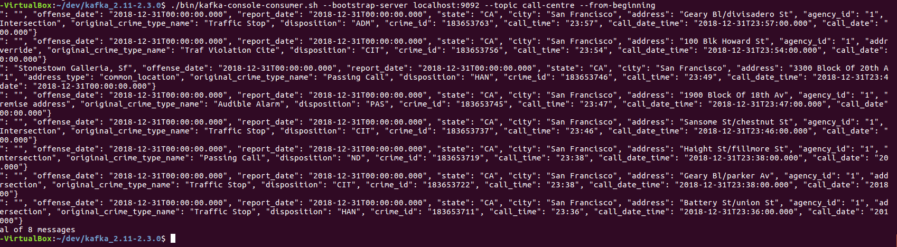
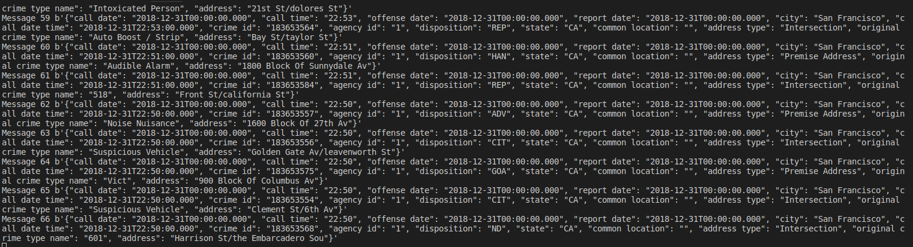
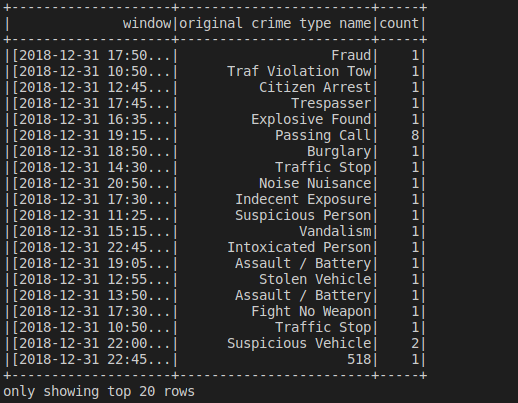

### SF Crime Statistics with Spark Streaming
​
## Introduction

In this project, we use real world dataset from the kaggle repositories on San Francisco crime incidents. statistical analysis is performed on this data using Apache Spark Structured Streaming. A kafka server is used to produce and consume the data through spark structured streaming. The output of the submission is as bellow:

## How to run the project

start Zookeeper and Kafka server, and your Kafka bootstrap server using the command below

`bin/zookeeper-server-start.sh config/zookeeper.properties`
`bin/kafka-server-start.sh config/server.properties`

To make sure that the the producer_server.py file is running correctly we can run the default consumer with the command 

`./bin/kafka-console-consumer.sh --bootstrap-server localhost:9092 --topic call-center --from-beginning`

The result can be seen in the screen capture below;

### kafka-console-consumer.sh

## Create and run the `consumer_server.py`

We create a `consumer_server.py` script to consume data produced from the kafka producer. Running it gets the follwoing results: 

### Consumer Console log

## we do a spark submit and run data_stream.py

do a spark submit using the command below

`Do a spark-submit using this command: spark-submit --packages org.apache.spark:spark-sql-kafka-0-10_2.11:2.3.0 --master local[4] data_stream.py`

### Data Stream

## How to run producer_server.py

use the command below to Check if the producer_server.py is correctly implemented 

`bin/kafka-console-consumer.sh --bootstrap-server localhost:9092 --topic call-centre --from-beginning`

### Requiremant

- Spark 2.4.3
- Scala 2.11.x
- Java 1.8.x
- Kafka build with Scala 2.11.x
- Python 3.6.x or 3.7.x

### Environment setup
​
- Download Spark from https://spark.apache.org/downloads.html. Choose Prebuilt for Apache Hadoop 2.7 and later
- Unpack Spark in one of your folders (I usually put all my dev requirements in /home/users/user/dev)
- Download Scala from the official site or for Mac users, you can also use brew install scala but make sure you download version 2.11.x
- Make sure your ~/.bash_profile looks like below (might be different based on your directory):
​
` export SPARK_HOME=/Users/dev/spark-2.3.0-bin-hadoop2.7
 export JAVA_HOME=/Library/Java/JavaVirtualMachines/jdk1.8.0_181.jdk/Contents/Home
 export SCALA_HOME=/usr/local/scala/
 export PATH=$JAVA_HOME/bin:$SPARK_HOME/bin:$SCALA_HOME/bin:$PATH`

